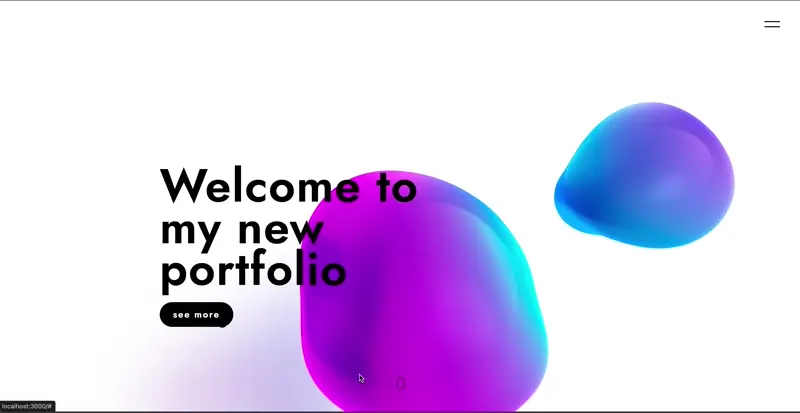

# Proyecto de Animaciones y Parallax con React y Next.js

Este proyecto demuestra el uso avanzado de animaciones y efectos de parallax utilizando React, Next.js, SASS, Framer Motion, Spline y Lenis. La aplicación incluye una navegación interactiva con un cursor magnético, smooth scrolling y animaciones reactivas a la interacción del usuario.

[]()
[]()
[]()
[]()
[]()
[]()

## Tecnologías Utilizadas

- **React**: Librería para construir interfaces de usuario.
- **Next.js**: Framework para aplicaciones React con renderizado del lado del servidor.
- **SASS**: Preprocesador CSS para estilos modulables y mantenibles.
- **Framer Motion**: Librería de animaciones para React.
- **Spline**: Herramienta para crear y renderizar modelos 3D interactivos.
- **Lenis**: Herramienta para smooth scrolling.



## Características del Proyecto

- **Animaciones de Parallax y Cursor Magnético**: Implementadas con Framer Motion.
- **Smooth Scrolling**: Proporcionado por Lenis.
- **Animaciones y Reactividad de Objetos**: Logradas mediante Spline.
- **Diseño Modular y Estilizado**: Gracias a SASS.

## Estructura del Proyecto

- `components`: Contiene componentes reutilizables como Header, NavBar, Cursor, etc.
- `pages`: Contiene las páginas del proyecto.
- `scss`: Contiene los archivos de estilos.
- `lib`: Incluye hooks personalizados como `useDimension`.

# Código Ejemplo

A continuación se muestra un ejemplo del componente que maneja el cursor magnético:

```javascript
import { useRef, useState } from "react";
import { motion } from "framer-motion";

export default function Framer({ children }) {
  const ref = useRef(null);
  const [position, setPosition] = useState({ x: 0, y: 0 });

  const handleMouse = (e) => {
    const { clientX, clientY } = e;
    const { height, width, left, top } = ref.current.getBoundingClientRect();
    const middleX = clientX - (left + width / 2);
    const middleY = clientY - (top + height / 2);
    setPosition({ x: middleX * 0.1, y: middleY * 0.1 });
  };

  const reset = () => {
    setPosition({ x: 0, y: 0 });
  };

  const { x, y } = position;
  return (
    <motion.div
      style={{ position: "relative" }}
      ref={ref}
      onMouseMove={handleMouse}
      onMouseLeave={reset}
      animate={{ x, y }}
      transition={{ type: "spring", stiffness: 350, damping: 5, mass: 0.5 }}
    >
      {children}
    </motion.div>
  );
}
```

---

¡Gracias por visitar este repositorio!
